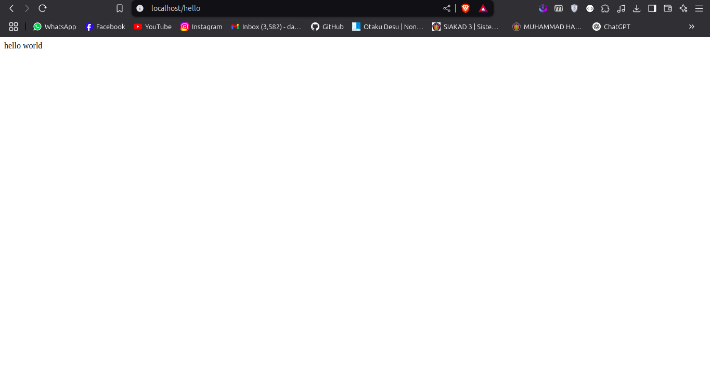
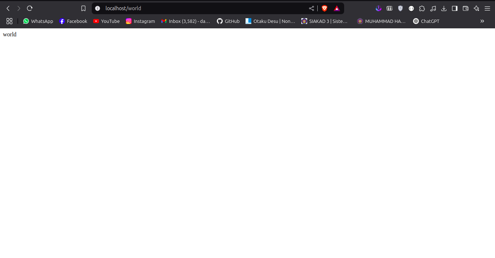
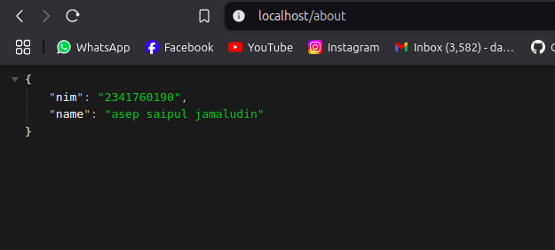
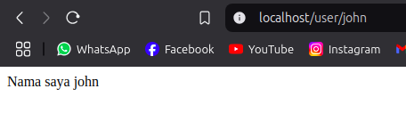
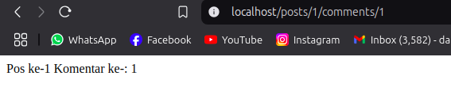
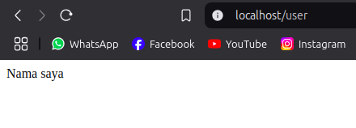
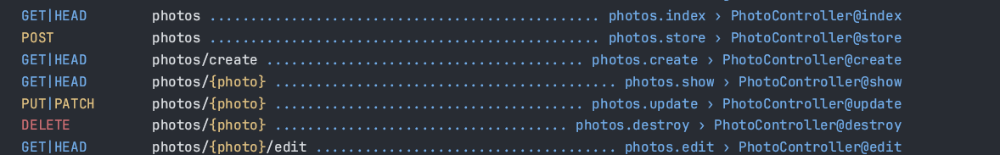
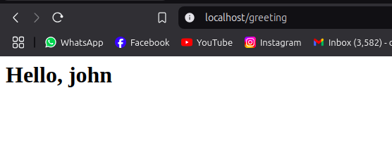
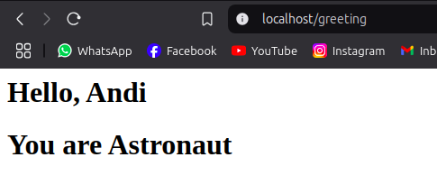

# Laporan Jobsheet 2

## Praktikum 1 routing

---

### Penulisan route /hello dan /world

```php
Route::get("/hello", function () {
    return "hello world";
});
```

```php
Route::get("/world", function () {
    return "world";
});
```

### Result dari route /hello



### Result dari route /world



### Penulisan route /about

```php
Route::get("/about", function () {
    return [
        "nim" => "2341760190",
        "name" => "asep saipul jamaludin",
    ];
});
```

### Result route /about



----

## Praktikum 2 route parameter

### Single route params

```php
Route::get("/user/{name}", function (string $name) {
    return "Nama saya " . $name;
});
```



### Mulitple route params

```php
Route::get("/posts/{post}/comments/{comment}", function (
    string $postId,
    string $commentId
) {
    return "Pos ke-" . $postId . " Komentar ke-: " . $commentId;
});
```



----

## Praktikum 3 optional params & route name

### optional params

Null default params

```php
Route::get("/user/{name?}", function (string|null $name = null) {
    return "Nama saya " . $name;
});
```



Default value params

```php
Route::get("/user/{name?}", function (string|null $name = "John") {
    return "Nama saya " . $name;
});
```

### route name

Naming routes

```php
Route::get("/user/profile", function () {
    //
})->name("profile");

Route::get("/user/profile", [UserProfileController::class, "show"])->name(
    "profile"
);
// Generating URLs...
$url = route("profile");
```
Grouping routes

```php
Route::middleware(["first", "second"])->group(function () {
    Route::get("/", function () {
        // Uses first & second middleware...
    });
    Route::get("/user/profile", function () {
        // Uses first & second middleware...
    });
});

Route::domain("{account}.example.com")->group(function () {
    Route::get("user/{id}", function ($account, $id) {
        //
    });
});
```
Grouping middleware routes

```php
Route::middleware("auth")->group(function () {
    Route::get("/user", [UserController::class, "index"]);
    Route::get("/post", [PostController::class, "index"]);
    Route::get("/event", [EventController::class, "index"]);
});
```

Redirecting route

```php
Route::redirect('/here', '/there');
```
Grouping routes with prefix

```php
Route::prefix("admin")->group(function () {
    Route::get("/user", [UserController::class, "index"]);
    Route::get("/post", [PostController::class, "index"]);
    Route::get("/event", [EventController::class, "index"]);
});
```

View
```php
Route::view('/welcome', 'welcome');
Route::view('/welcome', 'welcome', ['name' => 'Taylor']);
```
---

## Praktikum 4 controller

Modifikasi dari praktikum 2

Define routes

```php
Route::get("/", [HomeController::class, "index"]);
Route::get("/about", [AboutController::class, "about"]);
Route::get("/articles/{id}", [ArticleController::class, "articles"]);
```
Define controllers

```php
// HomeController
class HomeController extends Controller
{
    public function index()
    {
        return "home route";
    }
}
// AboutController
class AboutController extends Controller
{
    public function about()
    {
        return "about route";
    }
}
// ArticleController
class ArticleController extends Controller
{
    public function articles(string $id)
    {
        return "artikel no " . $id;
    }
}
```
----

## Praktikum 5 crud controller
File yg di generate dari command artisan make:controller PhotoController --resource

```php
class PhotoController extends Controller
{
    /**
     * Display a listing of the resource.
     */
    public function index()
    {
        //
    }

    /**
     * Show the form for creating a new resource.
     */
    public function create()
    {
        //
    }

    /**
     * Store a newly created resource in storage.
     */
    public function store(Request $request)
    {
        //
    }

    /**
     * Display the specified resource.
     */
    public function show(string $id)
    {
        //
    }

    /**
     * Show the form for editing the specified resource.
     */
    public function edit(string $id)
    {
        //
    }

    /**
     * Update the specified resource in storage.
     */
    public function update(Request $request, string $id)
    {
        //
    }

    /**
     * Remove the specified resource from storage.
     */
    public function destroy(string $id)
    {
        //
    }
}
```
Route list


----

## Praktikum 6 view

```php
Route::get("/greeting", function () {
    return view("hello", ["name" => "john"]);
});
```
blade template
```html
<html>
<body>
    <h1>Hello, {{ $name }}</h1>
</body>
</html>

```

result



Php merender file .blade.php ke client dan menginject array association ke file blade

----

## Praktikum 7 view dalam direktori

```php
class WelcomeController extends Controller
{
    public function hello()
    {
        return "hello route";
    }

    public function greeting()
    {
        return view('blog.hello')
            ->with('name', 'Andi')
            ->with('occupation', 'Astronaut');
    }
}
```

```html
<html>
<body>
    <h1>Hello, {{ $name }}</h1>
    <h1>You are {{ $occupation }}</h1>
</body>
</html>

```
Php merender file blade yg ada di /resources/views/blog/ dan menampilkan array association

Result



----
## Tugas praktikum
