# Laporan Praktikum Jobsheet 3


## Praktikum 1

1. Buat database PWL_POS
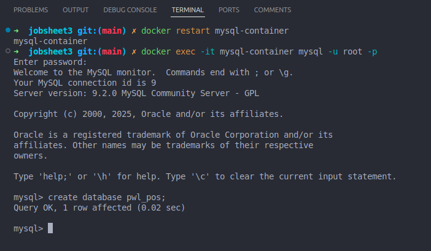
2. Konfigurasi .env
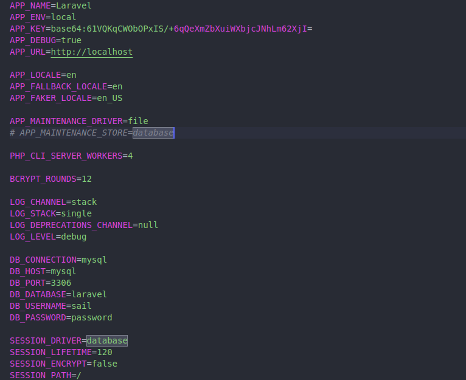


## Praktikum 2.1
1. Membuat migration tanpa relasi
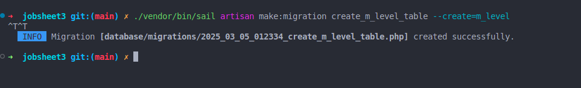
2. Modifikasi file migration
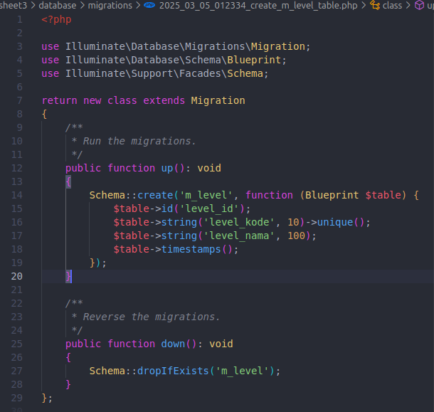
3. Migrasi table m_level
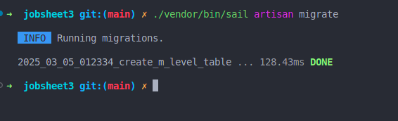
4. Table m_level
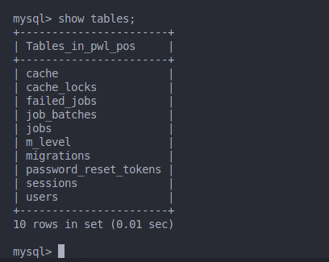
5. Membuat tabel m_kategori
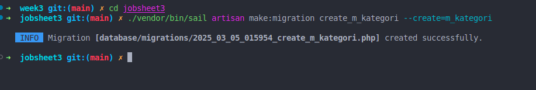
6. Migrasi m_kategori
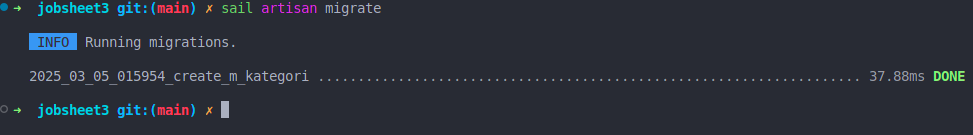


## Praktikum 2.2
1. Buat table m_user
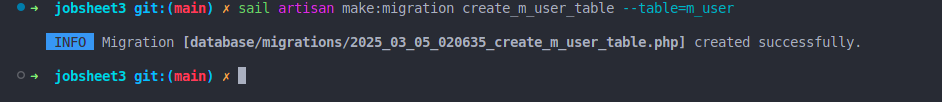
2. Modifikasi file migration
```php
 public function up(): void
    {
        Schema::table('m_user', function (Blueprint $table) {
            $table->id('user_id');
            $table->unsignedBigInteger('level_id')->index();
            $table->string('username', 20)->unique();
            $table->string('nama', 100);
            $table->string('password');
            $table->timestamps();

            $table->foreign('level_id')->references('level_id')->on('m_level');
        });
    }
```
3. Migrasai m_user
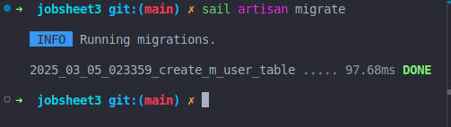

4. Tabel
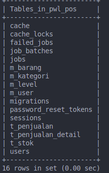


## Praktikum 3

1. m_level content

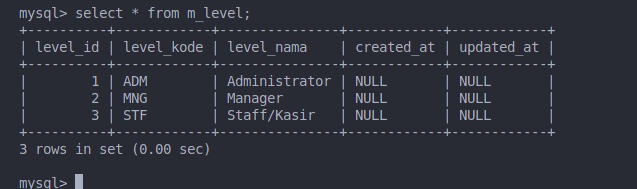

2. m_user content
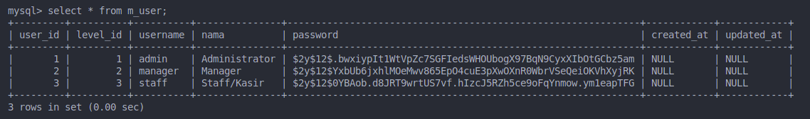

3. m_kategori
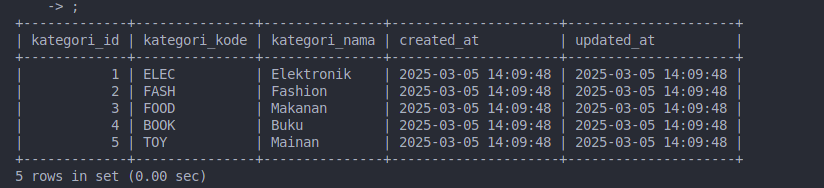

4. m_barang
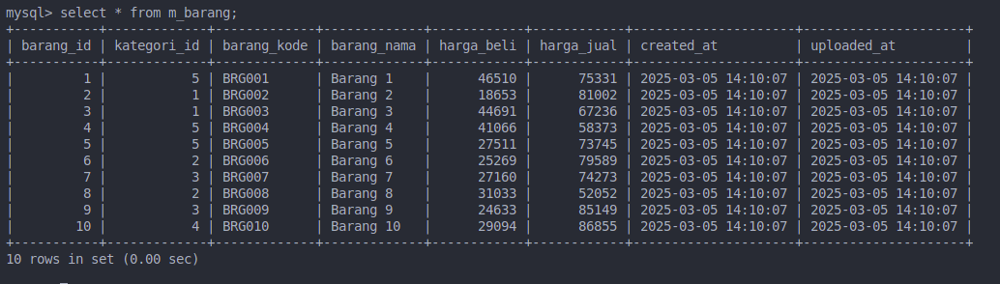

5. t_stok 
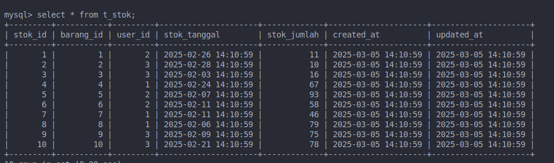

6. t_penjualan
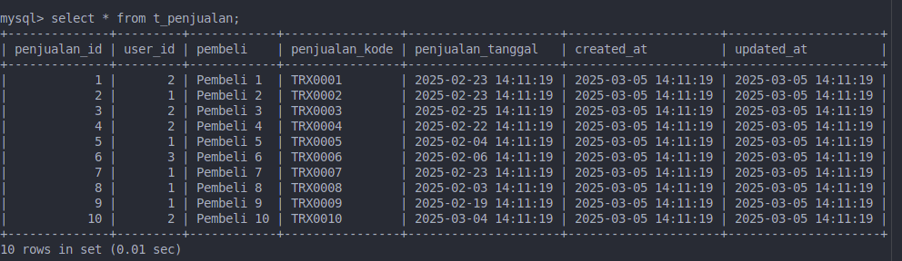

7. t_penjualan_detail
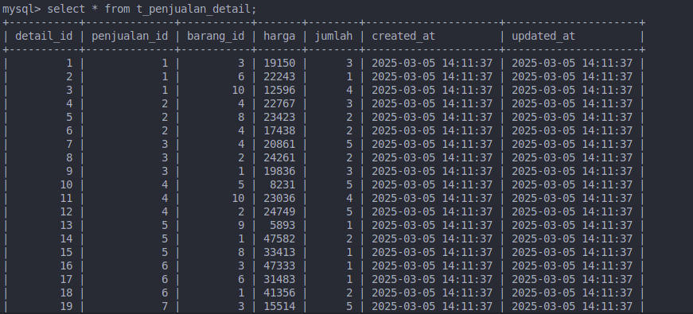


