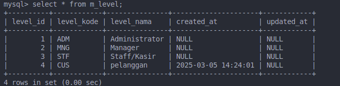

# Laporan Praktikum Jobsheet 3


## Praktikum 1

1. Buat database PWL_POS

2. Konfigurasi .env


## Praktikum 2.1
1. Membuat migration tanpa relasi

2. Modifikasi file migration

3. Migrasi table m_level

4. Table m_level

5. Membuat tabel m_kategori

6. Migrasi m_kategori


## Praktikum 2.2
1. Buat table m_user

2. Modifikasi file migration
```php
 public function up(): void
    {
        Schema::table('m_user', function (Blueprint $table) {
            $table->id('user_id');
            $table->unsignedBigInteger('level_id')->index();
            $table->string('username', 20)->unique();
            $table->string('nama', 100);
            $table->string('password');
            $table->timestamps();

            $table->foreign('level_id')->references('level_id')->on('m_level');
        });
    }
```
3. Migrasai m_user


4. Tabel


## Praktikum 3

1. m_level content


2. m_user content


3. m_kategori


4. m_barang


5. t_stok 


6. t_penjualan


7. t_penjualan_detail


----

## Praktikum 4
1. insert m_level
```php
<?php

namespace App\Http\Controllers;

use Illuminate\Http\Request;
use Illuminate\Support\Facades\DB;

class LevelController extends Controller
{
    //
    public function index()
    {
        DB::insert('insert into m_level (level_kode, level_nama, created_at) values(?,?,?)', ['CUS', 'pelanggan', now()]);

        return 'insert data baru berhasil';
    }
}

```
Data inserted




2. update m_level

```php
$row = DB::update('update m_level set level_nama = ? where level_kode = ?', ['Customer', 'CUS']);

return 'update data berhasil, ' . $row;
```
result

```
mysql> select * from m_level;
+----------+------------+---------------+---------------------+------------+
| level_id | level_kode | level_nama    | created_at          | updated_at |
+----------+------------+---------------+---------------------+------------+
|        1 | ADM        | Administrator | NULL                | NULL       |
|        2 | MNG        | Manager       | NULL                | NULL       |
|        3 | STF        | Staff/Kasir   | NULL                | NULL       |
|        4 | CUS        | Customer      | 2025-03-05 14:24:01 | NULL       |
+----------+------------+---------------+---------------------+------------+
4 rows in set (0.00 sec)
```

3. delete m_level
```php
$row = DB::delete('delete from m_level where level_kode = ?', ['CUS']);
return 'data berhasil di hapus ' . $row;
```

result
```
mysql> select * from m_level;
+----------+------------+---------------+------------+------------+
| level_id | level_kode | level_nama    | created_at | updated_at |
+----------+------------+---------------+------------+------------+
|        1 | ADM        | Administrator | NULL       | NULL       |
|        2 | MNG        | Manager       | NULL       | NULL       |
|        3 | STF        | Staff/Kasir   | NULL       | NULL       |
+----------+------------+---------------+------------+------------+
3 rows in set (0.00 sec)
```
4. select m_level
```php
$data = DB::select("select * from m_level");
return view('level', ['data' => $data]);
```

view
```html
<!DOCTYPE html>
<html lang="en">
<head>
    <meta charset="UTF-8">
    <meta name="viewport" content="width=device-width, initial-scale=1.0">
    <meta http-equiv="X-UA-Compatible" content="ie=edge">
    <title>Data Level Pengguna</title>
</head>
<body>
    <h1>Data level pengguna</h1>

    <table border="1" cellpadding="2" cellspacing="0">
        <tr>
            <th>ID</th>
            <th>kode level</th>
            <th>nama level</th>
        </tr>
        @foreach ($data as $d)
        <tr>
            <td>{{$d->level_id}}</td>
            <td>{{$d->level_kode}}</td>
            <td>{{$d->level_nama}}</td>
        </tr>
        @endforeach
    </table>
</body>
</html>
```

result 

