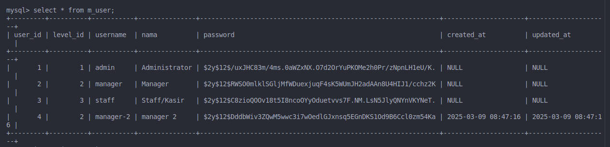
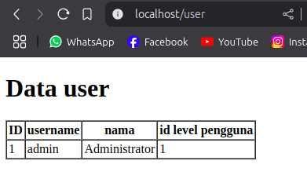
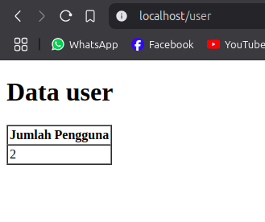

# Laporan Praktikum Jobsheet 4


## Praktikum 1

1. m_user db content


2. UserModel.php

```php
class UserModel extends Model
{
    //
    use HasFactory;

    protected $table = 'm_user';
    protected $primaryKey = 'user_id';

    protected $fillable = ['level_id', 'username', 'nama', 'password'];
}
```

3. UserController.php
```php

class UserController extends Controller
{
    //
    public function index()
    {

        $data = [
            'level_id' => 2,
            'username' => 'manager-2',
            'nama' => 'manager 2',
            'password' => Hash::make('1234'),
        ];

        UserModel::create($data);
        $user = UserModel::all();
        return view('user', ['data' => $user]);
    }
}
```

4. setelah di edit

```
SQLSTATE[HY000]: General error: 1364 Field 'password' doesn't 
have a default value (Connection: mysql, SQL: insert into `m_user` (`level_id`, `username`, `nama`, `updated_at`, `created_at`) values (2, manager-3, manager 3, 2025-03-09 08:58:23, 2025-03-09 08:58:23))
```
terjadi error karena $fillable tidak ada column password


## Praktikum 2.1




```php
$user = UserModel::find(1);
return view('user', ['data' => $user]);
``` 
kode diatas digunakan untuk mengambil data dari index pertama dari database


```php
$user = UserModel::where('level_id', 1)->first();
```
kode tersebut juga berfungsi sama
begitu juga dengan kode dibawah ini

```php
$user = UserModel::firstWhere('level_id', 1);

```

```php
 $user = UserModel::findOr(1, ['username', 'nama'], function () {
            abort(404);
    });
```
kode diatas memiliki behaviour yang sama tetapi hanya mengambil 2 kolom username dan nama, method tersebut juga bisa mengkondisikan jika data tidak ditemukan, dalam case ini dia akan meng abort

## Praktikum 2.2

```php
$user = UserModel::findOrFail(1);
```
kode tsb digunakan untuk mengambil data pertama di database, tapi akan return exception jika gagal

```php
$user = UserModel::where('username', 'manager9')->firstOrFail();
```
kode tsb mengambil data yang memiliki username manager9, jika tidak ada maka akan return exception not found (gagal)


## Praktikum 2.3


retrieving aggregrates

```php
$user = UserModel::where('level_id', 2)->count();
return view('user', ['data' => $user]);
```

```html
<table border="1" cellpadding="2" cellspacing="0">
    <tr>
        <th>Jumlah  Pengguna</th>
    </tr>
    <tr>         
        <td>{{$data}}</td>
    </tr>
</table>
```
result



## Praktikum 2.4