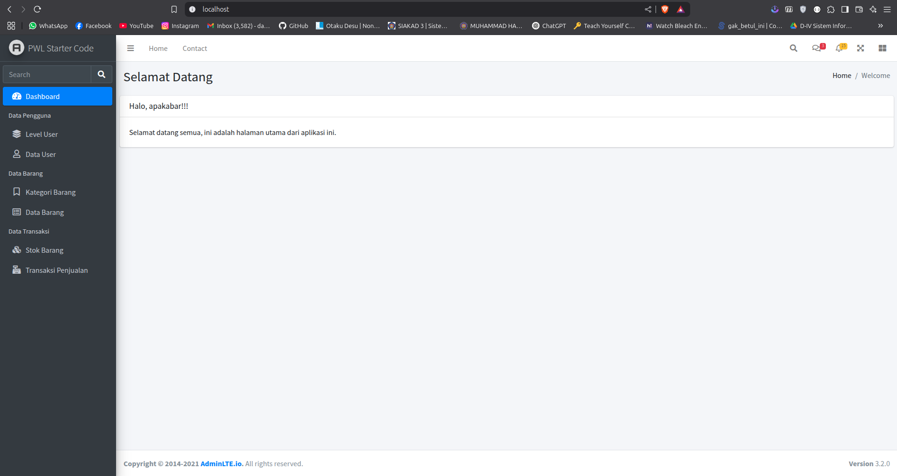

# Laporan praktikum jobsheet 5.2

## Praktikum 1

### download adminlte template

download dengan command linux

```sh
wget https://github.com/ColorlibHQ/AdminLTE/archive/refs/tags/v3.2.0.tar.gz -P ./public
```

extract filenya

```sh
tar -xf public/v3.2.0.tar.gz -C public/
```

rename ke adminlte

```sh
mv public/AdminLTE-3.2.0 public/adminlte
```

membuat template.blade.php

[Full file](https://github.com/hmdnu/PWL_2025/tree/main/week5/jobsheet5.2/resources/views/layouts/template.blade.php)

dikarenakan line code yg banyak saya hanya akan membuat href ke filenya saja yang sudah di modifikasi

list components
1. [header.blade.php](https://github.com/hmdnu/PWL_2025/tree/main/week5/jobsheet5.2/resources/views/layouts/header.blade.php)
2. [sidebar.blade.php](https://github.com/hmdnu/PWL_2025/tree/main/week5/jobsheet5.2/resources/views/layouts/sidebar.blade.php)
3. [breadcrumb.blade.php](https://github.com/hmdnu/PWL_2025/tree/main/week5/jobsheet5.2/resources/views/layouts/breadcrumb.blade.php)
4. [footer.blade.php](https://github.com/hmdnu/PWL_2025/tree/main/week5/jobsheet5.2/resources/views/layouts/footer.blade.php)


## Praktikum 2

### penerapan layouting

WelcomeController.php
```php
<?php
namespace App\Http\Controllers;

class WelcomeController extends Controller
{
    public function index()
    {
        $breadcrumb = (object) [
            'title' => 'Selamat Datang',
            'list' => ['Home', 'Welcome']
        ];

        $activeMenu = 'dashboard';

        return view('welcome', ['breadcrumb' => $breadcrumb, 'activeMenu' => $activeMenu]);
    }
}
```

modifikasi template.blade.php
```php
<!DOCTYPE html>
<html lang="en">

<head>
    <meta charset="utf-8">
    <meta name="viewport" content="width=device-width, initial-scale=1">
    <title>AdminLTE 3 | Blank Page</title>
    <!-- Google Font: Source Sans Pro -->
    <link rel="stylesheet"
        href="https://fonts.googleapis.com/css?family=Source+Sans+Pro:300,400,400i,700&display=fallback">
    <!-- Font Awesome -->
    {{-- <link rel="stylesheet" href="../../plugins/fontawesome-free/css/all.min.css"> --}}
    <link rel="stylesheet" href="{{ asset('adminlte/plugins/fontawesome-free/css/all.min.css') }}">
    <!-- Theme style -->
    {{-- <link rel="stylesheet" href="../../dist/css/adminlte.min.css"> --}}
    <link rel="stylesheet" href="{{ asset('adminlte/dist/css/adminlte.min.css') }}">

</head>

<body class="hold-transition sidebar-mini">
    <!-- Site wrapper -->
    <div class="wrapper">
        <!-- Navbar -->
        @include('layouts.header')
        <!-- /.navbar -->
        <!-- Main Sidebar Container -->
        <aside class="main-sidebar sidebar-dark-primary elevation-4">
            <!-- Brand Logo -->
            <a href="{{ url('/') }}" class="brand-link">
                
                <span class="brand-text font-weight-light">PWL Starter Code</span>
            </a>

            <!-- Sidebar -->
            @include('layouts.sidebar')
            <!-- /.sidebar -->
        </aside>

        <!-- Content Wrapper. Contains page content -->
        <div class="content-wrapper">
            <!-- Content Header (Page header) -->
            @include('layouts.breadcrumb')

            <!-- Main content -->
            <section class="content">
                @yield('content')
            </section>
            <!-- /.content -->
        </div>
        <!-- /.content-wrapper -->
        @include('layouts.footer')

    </div>
    <!-- ./wrapper -->

    <!-- jQuery -->
    <script src="{{ asset('adminlte/plugins/jquery/jquery.min.js') }}"></script>
    <script src="{{ asset('adminlte/plugins/bootstrap/js/bootstrap.bundle.min.js') }}"></script>
    <script src="{{ asset('adminlte/dist/js/adminlte.min.js') }}"></script>
</body>
</html>
```


modifikasi components

#### header.blade.php
```php
 <nav class="main-header navbar navbar-expand navbar-white navbar-light">
     <!-- Left navbar links -->
     <ul class="navbar-nav">
         <li class="nav-item">
             <a class="nav-link" data-widget="pushmenu" href="#" role="button"><i class="fas fa-bars"></i></a>
         </li>
         <li class="nav-item d-none d-sm-inline-block">
             <a href="../../index3.html" class="nav-link">Home</a>
         </li>
         <li class="nav-item d-none d-sm-inline-block">
             <a href="#" class="nav-link">Contact</a>
         </li>
     </ul>

     <!-- Right navbar links -->
     <ul class="navbar-nav ml-auto">
         <!-- Navbar Search -->
         <li class="nav-item">
             <a class="nav-link" data-widget="navbar-search" href="#" role="button">
                 <i class="fas fa-search"></i>
             </a>
             <div class="navbar-search-block">
                 <form class="form-inline">
                     <div class="input-group input-group-sm">
                         <input class="form-control form-control-navbar" type="search" placeholder="Search"
                             aria-label="Search">
                         <div class="input-group-append">
                             <button class="btn btn-navbar" type="submit">
                                 <i class="fas fa-search"></i>
                             </button>
                             <button class="btn btn-navbar" type="button" data-widget="navbar-search">
                                 <i class="fas fa-times"></i>
                             </button>
                         </div>
                     </div>
                 </form>
             </div>
         </li>

         <!-- Messages Dropdown Menu -->
         <li class="nav-item dropdown">
             <a class="nav-link" data-toggle="dropdown" href="#">
                 <i class="far fa-comments"></i>
                 <span class="badge badge-danger navbar-badge">3</span>
             </a>
             <div class="dropdown-menu dropdown-menu-lg dropdown-menu-right">
                 <a href="#" class="dropdown-item">
                     <!-- Message Start -->
                     <div class="media">
                         
                         <div class="media-body">
                             <h3 class="dropdown-item-title">
                                 Brad Diesel
                                 <span class="float-right text-sm text-danger"><i class="fas fa-star"></i></span>
                             </h3>
                             <p class="text-sm">Call me whenever you can...</p>
                             <p class="text-sm text-muted"><i class="far fa-clock mr-1"></i> 4 Hours Ago</p>
                         </div>
                     </div>
                     <!-- Message End -->
                 </a>
                 <div class="dropdown-divider"></div>
                 <a href="#" class="dropdown-item">
                     <!-- Message Start -->
                     <div class="media">
                         
                         <div class="media-body">
                             <h3 class="dropdown-item-title">
                                 John Pierce
                                 <span class="float-right text-sm text-muted"><i class="fas fa-star"></i></span>
                             </h3>
                             <p class="text-sm">I got your message bro</p>
                             <p class="text-sm text-muted"><i class="far fa-clock mr-1"></i> 4 Hours Ago</p>
                         </div>
                     </div>
                     <!-- Message End -->
                 </a>
                 <div class="dropdown-divider"></div>
                 <a href="#" class="dropdown-item">
                     <!-- Message Start -->
                     <div class="media">
                         
                         <div class="media-body">
                             <h3 class="dropdown-item-title">
                                 Nora Silvester
                                 <span class="float-right text-sm text-warning"><i class="fas fa-star"></i></span>
                             </h3>
                             <p class="text-sm">The subject goes here</p>
                             <p class="text-sm text-muted"><i class="far fa-clock mr-1"></i> 4 Hours Ago</p>
                         </div>
                     </div>
                     <!-- Message End -->
                 </a>
                 <div class="dropdown-divider"></div>
                 <a href="#" class="dropdown-item dropdown-footer">See All Messages</a>
             </div>
         </li>
         <!-- Notifications Dropdown Menu -->
         <li class="nav-item dropdown">
             <a class="nav-link" data-toggle="dropdown" href="#">
                 <i class="far fa-bell"></i>
                 <span class="badge badge-warning navbar-badge">15</span>
             </a>
             <div class="dropdown-menu dropdown-menu-lg dropdown-menu-right">
                 <span class="dropdown-item dropdown-header">15 Notifications</span>
                 <div class="dropdown-divider"></div>
                 <a href="#" class="dropdown-item">
                     <i class="fas fa-envelope mr-2"></i> 4 new messages
                     <span class="float-right text-muted text-sm">3 mins</span>
                 </a>
                 <div class="dropdown-divider"></div>
                 <a href="#" class="dropdown-item">
                     <i class="fas fa-users mr-2"></i> 8 friend requests
                     <span class="float-right text-muted text-sm">12 hours</span>
                 </a>
                 <div class="dropdown-divider"></div>
                 <a href="#" class="dropdown-item">
                     <i class="fas fa-file mr-2"></i> 3 new reports
                     <span class="float-right text-muted text-sm">2 days</span>
                 </a>
                 <div class="dropdown-divider"></div>
                 <a href="#" class="dropdown-item dropdown-footer">See All Notifications</a>
             </div>
         </li>
         <li class="nav-item">
             <a class="nav-link" data-widget="fullscreen" href="#" role="button">
                 <i class="fas fa-expand-arrows-alt"></i>
             </a>
         </li>
         <li class="nav-item">
             <a class="nav-link" data-widget="control-sidebar" data-slide="true" href="#" role="button">
                 <i class="fas fa-th-large"></i>
             </a>
         </li>
     </ul>
 </nav>
```
#### breadcrumb.blade.php
```php
<section class="content-header">
    <div class="container-fluid">
        <div class="row mb-2">
            <div class="col-sm-6">
                <h1>{{ $breadcrumb->title }}</h1>
            </div>
            <div class="col-sm-6">
                <ol class="breadcrumb float-sm-right">
                    @foreach ($breadcrumb->list as $key => $value)
                        @if ($key == count($breadcrumb->list) - 1)
                            <li class="breadcrumb-item active">{{ $value }}</li>
                        @else
                            <li class="breadcrumb-item">{{ $value }}</li>
                        @endif
                    @endforeach
                </ol>
            </div>
        </div>
    </div>
</section>
```

#### sidebar.blade.php
```php
<div class="sidebar">
    <!-- SidebarSearch Form -->
    <div class="form-inline mt-2">
        <div class="input-group" data-widget="sidebar-search">
            <input class="form-control form-control-sidebar" type="search" placeholder="Search" aria-label="Search">
            <div class="input-group-append">
                <button class="btn btn-sidebar">
                    <i class="fas fa-search fa-fw"></i>
                </button>
            </div>
        </div>
    </div>
    <!-- Sidebar Menu -->
    <nav class="mt-2">
        <ul class="nav nav-pills nav-sidebar flex-column" data-widget="treeview" role="menu" data-accordion="false">
            <li class="nav-item">
                <a href="{{ url('/') }}" class="nav-link {{ $activeMenu == 'dashboard' ? 'active' : '' }} ">
                    <i class="nav-icon fas fa-tachometer-alt"></i>
                    <p>Dashboard</p>
                </a>
            </li>
            <li class="nav-header">Data Pengguna</li>
            <li class="nav-item">
                <a href="{{ url('/level') }}" class="nav-link {{ $activeMenu == 'level' ? 'active' : '' }} ">
                    <i class="nav-icon fas fa-layer-group"></i>
                    <p>Level User</p>
                </a>
            </li>
            <li class="nav-item">
                <a href="{{ url('/user') }}" class="nav-link {{ $activeMenu == 'user' ? 'active' : '' }}">
                    <i class="nav-icon far fa-user"></i>
                    <p>Data User</p>
                </a>
            </li>
            <li class="nav-header">Data Barang</li>
            <li class="nav-item">
                <a href="{{ url('/kategori') }}" class="nav-link {{ $activeMenu == 'kategori' ? 'active' : '' }} ">
                    <i class="nav-icon far fa-bookmark"></i>
                    <p>Kategori Barang</p>
                </a>
            </li>
            <li class="nav-item">
                <a href="{{ url('/barang') }}" class="nav-link {{ $activeMenu == 'barang' ? 'active' : '' }} ">
                    <i class="nav-icon far fa-list-alt"></i>
                    <p>Data Barang</p>
                </a>
            </li>
            <li class="nav-header">Data Transaksi</li>
            <li class="nav-item">
                <a href="{{ url('/stok') }}" class="nav-link {{ $activeMenu == 'stok' ? 'active' : '' }} ">
                    <i class="nav-icon fas fa-cubes"></i>
                    <p>Stok Barang</p>
                </a>
            </li>
            <li class="nav-item">
                <a href="{{ url('/barang') }}" class="nav-link {{ $activeMenu == 'penjualan' ? 'active' : '' }} ">
                    <i class="nav-icon fas fa-cash-register"></i>
                    <p>Transaksi Penjualan</p>
                </a>
            </li>
        </ul>
    </nav>
</div>

```

#### hasil
