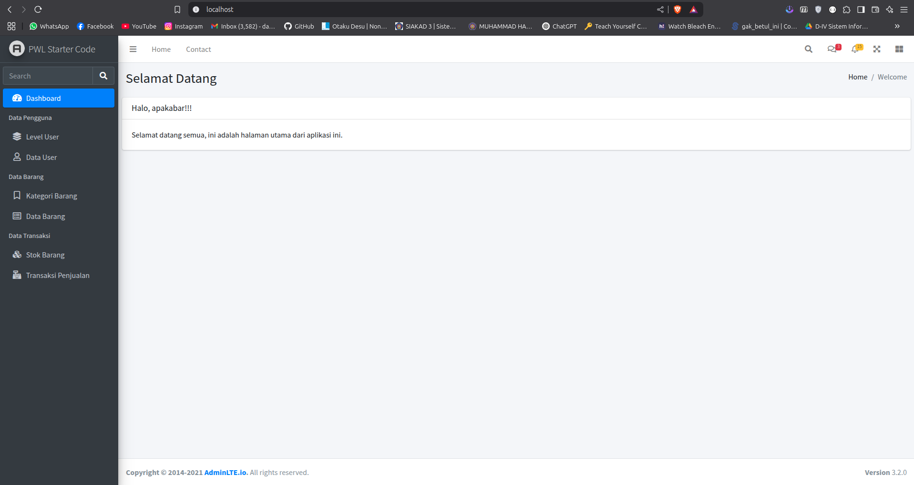
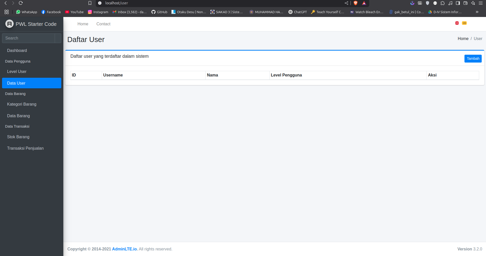
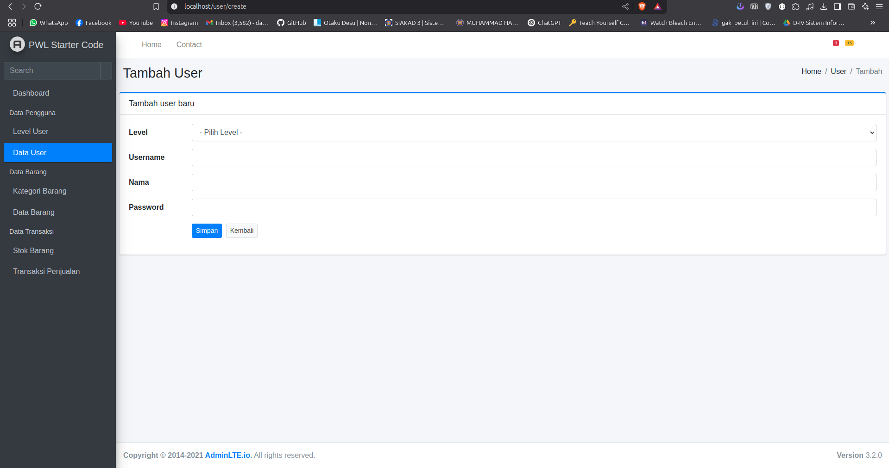
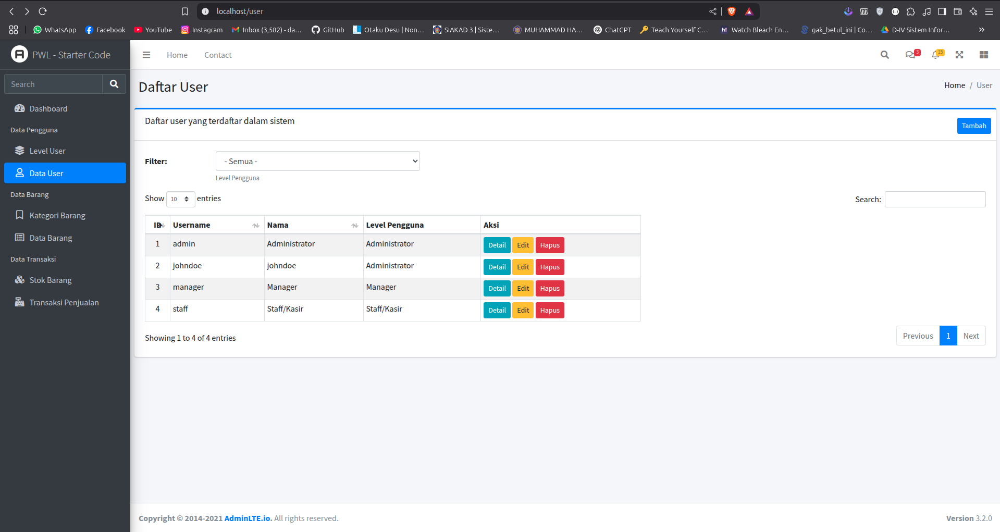
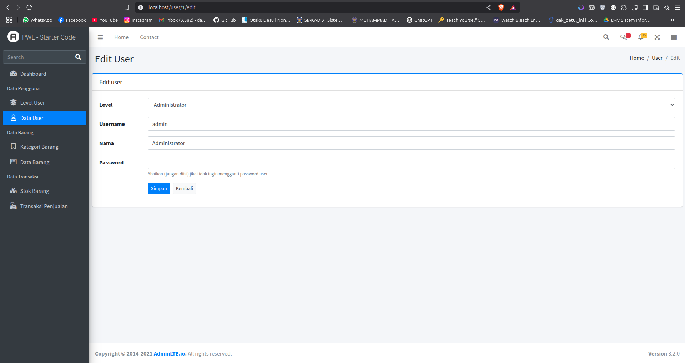
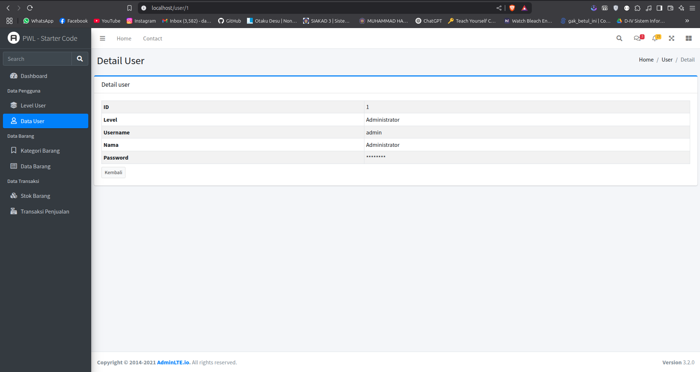

# Laporan praktikum jobsheet 5.2

## Praktikum 1

### download adminlte template

download dengan command linux

```sh
wget https://github.com/ColorlibHQ/AdminLTE/archive/refs/tags/v3.2.0.tar.gz -P ./public
```

extract filenya

```sh
tar -xf public/v3.2.0.tar.gz -C public/
```

rename ke adminlte

```sh
mv public/AdminLTE-3.2.0 public/adminlte
```

membuat template.blade.php

[Full file](https://github.com/hmdnu/PWL_2025/tree/main/week5/jobsheet5.2/resources/views/layouts/template.blade.php)

dikarenakan line code yg banyak saya hanya akan membuat href ke filenya saja yang sudah di modifikasi

list components
1. [header.blade.php](https://github.com/hmdnu/PWL_2025/tree/main/week5/jobsheet5.2/resources/views/layouts/header.blade.php)
2. [sidebar.blade.php](https://github.com/hmdnu/PWL_2025/tree/main/week5/jobsheet5.2/resources/views/layouts/sidebar.blade.php)
3. [breadcrumb.blade.php](https://github.com/hmdnu/PWL_2025/tree/main/week5/jobsheet5.2/resources/views/layouts/breadcrumb.blade.php)
4. [footer.blade.php](https://github.com/hmdnu/PWL_2025/tree/main/week5/jobsheet5.2/resources/views/layouts/footer.blade.php)


## Praktikum 2

### penerapan layouting

WelcomeController.php
```php
<?php
namespace App\Http\Controllers;

class WelcomeController extends Controller
{
    public function index()
    {
        $breadcrumb = (object) [
            'title' => 'Selamat Datang',
            'list' => ['Home', 'Welcome']
        ];

        $activeMenu = 'dashboard';

        return view('welcome', ['breadcrumb' => $breadcrumb, 'activeMenu' => $activeMenu]);
    }
}
```

modifikasi template.blade.php
```php
<!DOCTYPE html>
<html lang="en">

<head>
    <meta charset="utf-8">
    <meta name="viewport" content="width=device-width, initial-scale=1">
    <title>AdminLTE 3 | Blank Page</title>
    <!-- Google Font: Source Sans Pro -->
    <link rel="stylesheet"
        href="https://fonts.googleapis.com/css?family=Source+Sans+Pro:300,400,400i,700&display=fallback">
    <!-- Font Awesome -->
    {{-- <link rel="stylesheet" href="../../plugins/fontawesome-free/css/all.min.css"> --}}
    <link rel="stylesheet" href="{{ asset('adminlte/plugins/fontawesome-free/css/all.min.css') }}">
    <!-- Theme style -->
    {{-- <link rel="stylesheet" href="../../dist/css/adminlte.min.css"> --}}
    <link rel="stylesheet" href="{{ asset('adminlte/dist/css/adminlte.min.css') }}">

</head>

<body class="hold-transition sidebar-mini">
    <!-- Site wrapper -->
    <div class="wrapper">
        <!-- Navbar -->
        @include('layouts.header')
        <!-- /.navbar -->
        <!-- Main Sidebar Container -->
        <aside class="main-sidebar sidebar-dark-primary elevation-4">
            <!-- Brand Logo -->
            <a href="{{ url('/') }}" class="brand-link">
                
                <span class="brand-text font-weight-light">PWL Starter Code</span>
            </a>

            <!-- Sidebar -->
            @include('layouts.sidebar')
            <!-- /.sidebar -->
        </aside>

        <!-- Content Wrapper. Contains page content -->
        <div class="content-wrapper">
            <!-- Content Header (Page header) -->
            @include('layouts.breadcrumb')

            <!-- Main content -->
            <section class="content">
                @yield('content')
            </section>
            <!-- /.content -->
        </div>
        <!-- /.content-wrapper -->
        @include('layouts.footer')

    </div>
    <!-- ./wrapper -->

    <!-- jQuery -->
    <script src="{{ asset('adminlte/plugins/jquery/jquery.min.js') }}"></script>
    <script src="{{ asset('adminlte/plugins/bootstrap/js/bootstrap.bundle.min.js') }}"></script>
    <script src="{{ asset('adminlte/dist/js/adminlte.min.js') }}"></script>
</body>
</html>
```


modifikasi components

#### header.blade.php
```php
 <nav class="main-header navbar navbar-expand navbar-white navbar-light">
     <!-- Left navbar links -->
     <ul class="navbar-nav">
         <li class="nav-item">
             <a class="nav-link" data-widget="pushmenu" href="#" role="button"><i class="fas fa-bars"></i></a>
         </li>
         <li class="nav-item d-none d-sm-inline-block">
             <a href="../../index3.html" class="nav-link">Home</a>
         </li>
         <li class="nav-item d-none d-sm-inline-block">
             <a href="#" class="nav-link">Contact</a>
         </li>
     </ul>

     <!-- Right navbar links -->
     <ul class="navbar-nav ml-auto">
         <!-- Navbar Search -->
         <li class="nav-item">
             <a class="nav-link" data-widget="navbar-search" href="#" role="button">
                 <i class="fas fa-search"></i>
             </a>
             <div class="navbar-search-block">
                 <form class="form-inline">
                     <div class="input-group input-group-sm">
                         <input class="form-control form-control-navbar" type="search" placeholder="Search"
                             aria-label="Search">
                         <div class="input-group-append">
                             <button class="btn btn-navbar" type="submit">
                                 <i class="fas fa-search"></i>
                             </button>
                             <button class="btn btn-navbar" type="button" data-widget="navbar-search">
                                 <i class="fas fa-times"></i>
                             </button>
                         </div>
                     </div>
                 </form>
             </div>
         </li>

         <!-- Messages Dropdown Menu -->
         <li class="nav-item dropdown">
             <a class="nav-link" data-toggle="dropdown" href="#">
                 <i class="far fa-comments"></i>
                 <span class="badge badge-danger navbar-badge">3</span>
             </a>
             <div class="dropdown-menu dropdown-menu-lg dropdown-menu-right">
                 <a href="#" class="dropdown-item">
                     <!-- Message Start -->
                     <div class="media">
                         
                         <div class="media-body">
                             <h3 class="dropdown-item-title">
                                 Brad Diesel
                                 <span class="float-right text-sm text-danger"><i class="fas fa-star"></i></span>
                             </h3>
                             <p class="text-sm">Call me whenever you can...</p>
                             <p class="text-sm text-muted"><i class="far fa-clock mr-1"></i> 4 Hours Ago</p>
                         </div>
                     </div>
                     <!-- Message End -->
                 </a>
                 <div class="dropdown-divider"></div>
                 <a href="#" class="dropdown-item">
                     <!-- Message Start -->
                     <div class="media">
                         
                         <div class="media-body">
                             <h3 class="dropdown-item-title">
                                 John Pierce
                                 <span class="float-right text-sm text-muted"><i class="fas fa-star"></i></span>
                             </h3>
                             <p class="text-sm">I got your message bro</p>
                             <p class="text-sm text-muted"><i class="far fa-clock mr-1"></i> 4 Hours Ago</p>
                         </div>
                     </div>
                     <!-- Message End -->
                 </a>
                 <div class="dropdown-divider"></div>
                 <a href="#" class="dropdown-item">
                     <!-- Message Start -->
                     <div class="media">
                         
                         <div class="media-body">
                             <h3 class="dropdown-item-title">
                                 Nora Silvester
                                 <span class="float-right text-sm text-warning"><i class="fas fa-star"></i></span>
                             </h3>
                             <p class="text-sm">The subject goes here</p>
                             <p class="text-sm text-muted"><i class="far fa-clock mr-1"></i> 4 Hours Ago</p>
                         </div>
                     </div>
                     <!-- Message End -->
                 </a>
                 <div class="dropdown-divider"></div>
                 <a href="#" class="dropdown-item dropdown-footer">See All Messages</a>
             </div>
         </li>
         <!-- Notifications Dropdown Menu -->
         <li class="nav-item dropdown">
             <a class="nav-link" data-toggle="dropdown" href="#">
                 <i class="far fa-bell"></i>
                 <span class="badge badge-warning navbar-badge">15</span>
             </a>
             <div class="dropdown-menu dropdown-menu-lg dropdown-menu-right">
                 <span class="dropdown-item dropdown-header">15 Notifications</span>
                 <div class="dropdown-divider"></div>
                 <a href="#" class="dropdown-item">
                     <i class="fas fa-envelope mr-2"></i> 4 new messages
                     <span class="float-right text-muted text-sm">3 mins</span>
                 </a>
                 <div class="dropdown-divider"></div>
                 <a href="#" class="dropdown-item">
                     <i class="fas fa-users mr-2"></i> 8 friend requests
                     <span class="float-right text-muted text-sm">12 hours</span>
                 </a>
                 <div class="dropdown-divider"></div>
                 <a href="#" class="dropdown-item">
                     <i class="fas fa-file mr-2"></i> 3 new reports
                     <span class="float-right text-muted text-sm">2 days</span>
                 </a>
                 <div class="dropdown-divider"></div>
                 <a href="#" class="dropdown-item dropdown-footer">See All Notifications</a>
             </div>
         </li>
         <li class="nav-item">
             <a class="nav-link" data-widget="fullscreen" href="#" role="button">
                 <i class="fas fa-expand-arrows-alt"></i>
             </a>
         </li>
         <li class="nav-item">
             <a class="nav-link" data-widget="control-sidebar" data-slide="true" href="#" role="button">
                 <i class="fas fa-th-large"></i>
             </a>
         </li>
     </ul>
 </nav>
```
#### breadcrumb.blade.php
```php
<section class="content-header">
    <div class="container-fluid">
        <div class="row mb-2">
            <div class="col-sm-6">
                <h1>{{ $breadcrumb->title }}</h1>
            </div>
            <div class="col-sm-6">
                <ol class="breadcrumb float-sm-right">
                    @foreach ($breadcrumb->list as $key => $value)
                        @if ($key == count($breadcrumb->list) - 1)
                            <li class="breadcrumb-item active">{{ $value }}</li>
                        @else
                            <li class="breadcrumb-item">{{ $value }}</li>
                        @endif
                    @endforeach
                </ol>
            </div>
        </div>
    </div>
</section>
```

#### sidebar.blade.php
```php
<div class="sidebar">
    <!-- SidebarSearch Form -->
    <div class="form-inline mt-2">
        <div class="input-group" data-widget="sidebar-search">
            <input class="form-control form-control-sidebar" type="search" placeholder="Search" aria-label="Search">
            <div class="input-group-append">
                <button class="btn btn-sidebar">
                    <i class="fas fa-search fa-fw"></i>
                </button>
            </div>
        </div>
    </div>
    <!-- Sidebar Menu -->
    <nav class="mt-2">
        <ul class="nav nav-pills nav-sidebar flex-column" data-widget="treeview" role="menu" data-accordion="false">
            <li class="nav-item">
                <a href="{{ url('/') }}" class="nav-link {{ $activeMenu == 'dashboard' ? 'active' : '' }} ">
                    <i class="nav-icon fas fa-tachometer-alt"></i>
                    <p>Dashboard</p>
                </a>
            </li>
            <li class="nav-header">Data Pengguna</li>
            <li class="nav-item">
                <a href="{{ url('/level') }}" class="nav-link {{ $activeMenu == 'level' ? 'active' : '' }} ">
                    <i class="nav-icon fas fa-layer-group"></i>
                    <p>Level User</p>
                </a>
            </li>
            <li class="nav-item">
                <a href="{{ url('/user') }}" class="nav-link {{ $activeMenu == 'user' ? 'active' : '' }}">
                    <i class="nav-icon far fa-user"></i>
                    <p>Data User</p>
                </a>
            </li>
            <li class="nav-header">Data Barang</li>
            <li class="nav-item">
                <a href="{{ url('/kategori') }}" class="nav-link {{ $activeMenu == 'kategori' ? 'active' : '' }} ">
                    <i class="nav-icon far fa-bookmark"></i>
                    <p>Kategori Barang</p>
                </a>
            </li>
            <li class="nav-item">
                <a href="{{ url('/barang') }}" class="nav-link {{ $activeMenu == 'barang' ? 'active' : '' }} ">
                    <i class="nav-icon far fa-list-alt"></i>
                    <p>Data Barang</p>
                </a>
            </li>
            <li class="nav-header">Data Transaksi</li>
            <li class="nav-item">
                <a href="{{ url('/stok') }}" class="nav-link {{ $activeMenu == 'stok' ? 'active' : '' }} ">
                    <i class="nav-icon fas fa-cubes"></i>
                    <p>Stok Barang</p>
                </a>
            </li>
            <li class="nav-item">
                <a href="{{ url('/barang') }}" class="nav-link {{ $activeMenu == 'penjualan' ? 'active' : '' }} ">
                    <i class="nav-icon fas fa-cash-register"></i>
                    <p>Transaksi Penjualan</p>
                </a>
            </li>
        </ul>
    </nav>
</div>

```

#### hasil



## Praktikum 3

### membuat user page

full file
1. [UserController.php](https://github.com/hmdnu/PWL_2025/tree/main/week5/jobsheet5.2/app/Http/Controllers/UserController.php)
2. [index.blade.php](https://github.com/hmdnu/PWL_2025/tree/main/week5/jobsheet5.2/resources/views/user/index.blade.php)
3. 

UserController -> index
```php
public function index()
{
    $breadcrumb = (object) [
        'title' => 'Daftar User',
        'list' => ['Home', 'User']
    ];

    $page = (object) [
        'title' => 'Daftar user yang terdaftar dalam sistem'
    ];

    $activeMenu = 'user'; // set menu yang sedang aktif

    return view('user.index', ['breadcrumb' => $breadcrumb, 'page' => $page, 'activeMenu' => $activeMenu]);
}
```

UserController -> list
```php
public function list(Request $request)
{
    $users = UserModel::select('user_id', 'username', 'nama', 'level_id')
        ->with('level');
    return DataTables::of($users)
        // menambahkan kolom index / no urut (default nama kolom: DT_RowIndex)
        ->addIndexColumn()
        ->addColumn('aksi', function ($user) { // menambahkan kolom aksi
            $btn = '<a href="' . url('/user/' . $user->user_id) . '" class="btn btn-info btnsm">Detail</a> ';
            $btn .= '<a href="' . url('/user/' . $user->user_id . '/edit') . '" class="btn btnwarning btn-sm">Edit</a> ';
            $btn .= '<form class="d-inline-block" method="POST" action="' .
                url('/user/' . $user->user_id) . '">'
                . csrf_field() . method_field('DELETE') .
                '<button type="submit" class="btn btn-danger btn-sm" onclick="return confirm(\'Apakah Anda yakit menghapus data ini?\');">Hapus</button></form>';
            return $btn;
        })
        ->rawColumns(['aksi']) // memberitahu bahwa kolom aksi adalah html
        ->make(true);
}
```

index.blade.php

```php
@extends('layouts.template')
@section('content')
    <div class="card card-outline card-primary">
        <div class="card-header">
            <h3 class="card-title">{{ $page->title }}</h3>
            <div class="card-tools">
                <a class="btn btn-sm btn-primary mt-1" href="{{ url('user/create') }}">Tambah</a>
            </div>
        </div>
        <div class="card-body">
            <table class="table table-bordered table-striped table-hover table-sm" id="table_user">
                <thead>
                    <tr>
                        <th>ID</th>
                        <th>Username</th>
                        <th>Nama</th>
                        <th>Level
                            Pengguna</th>
                        <th>Aksi</th>
                    </tr>
                </thead>
            </table>
        </div>
    </div>
@endsection
@push('css')
@endpush
@push('js')
    <script>
        $(document).ready(function() {
            var dataUser = $('#table_user').DataTable({
                // serverSide: true, jika ingin menggunakan server side processing
                serverSide: true,
                ajax: {
                    "url": "{{ url('user/list') }}",
                    "dataType": "json",
                    "type": "POST"
                },
                columns: [{
                    // nomor urut dari laravel datatable addIndexColumn()
                    data: "DT_RowIndex",
                    className: "text-center",
                    orderable: false,
                    searchable: false
                }, {
                    data: "username",
                    className: "",
                    // orderable: true, jika ingin kolom ini bisa diurutkan
                    orderable: true,
                    // searchable: true, jika ingin kolom ini bisa dicari
                    searchable: true
                }, {
                    data: "nama",
                    className: "",
                    orderable: true,
                    searchable: true
                }, {
                    // mengambil data level hasil dari ORM berelasi
                    data: "level.level_nama",
                    className: "",
                    orderable: false,
                    searchable: false
                }, {
                    data: "aksi",
                    className: "",
                    orderable: false,
                    searchable: false
                }]
            });
        });
    </script>
@endpush
```

hasil



form tambah user

modifikasi UserController.php

```php
// Menampilkan halaman form tambah user
public function create()
{
    $breadcrumb = (object) [
        'title' => 'Tambah User',
        'list' => ['Home', 'User', 'Tambah']
    ];

    $page = (object) [
        'title' => 'Tambah user baru'
    ];

    $level = LevelModel::all(); // ambil data level untuk ditampilkan di form
    $activeMenu = 'user'; // set menu yang sedang aktif

    return view('user.create', ['breadcrumb' => $breadcrumb, 'page' => $page, 'level' => $level, 'activeMenu' => $activeMenu]);
}
```

membuat client form

create.blade.php
```php
@extends('layouts.template')
@section('content')
    <div class="card card-outline card-primary">
        <div class="card-header">
            <h3 class="card-title">{{ $page->title }}</h3>
            <div class="card-tools"></div>
        </div>
        <div class="card-body">
            <form method="POST" action="{{ url('user') }}" class="form-horizontal">
                @csrf
                <div class="form-group row">
                    <label class="col-1 control-label col-form-label">Level</label>
                    <div class="col-11">
                        <select class="form-control" id="level_id" name="level_id" required>
                            <option value="">- Pilih Level -</option>
                            @foreach ($level as $item)
                                <option value="{{ $item->level_id }}">{{ $item->level_nama }}</option>
                            @endforeach
                        </select>
                        @error('level_id')
                            <small class="form-text text-danger">{{ $message }}</small>
                        @enderror
                    </div>
                </div>
                <div class="form-group row">
                    <label class="col-1 control-label col-form-label">Username</label>
                    <div class="col-11">
                        <input type="text" class="form-control" id="username" name="username"
                            value="{{ old('username') }}" required>
                        @error('username')
                            <small class="form-text text-danger">{{ $message }}</small>
                        @enderror
                    </div>
                </div>
                <div class="form-group row">
                    <label class="col-1 control-label col-form-label">Nama</label>
                    <div class="col-11">
                        <input type="text" class="form-control" id="nama" name="nama" value="{{ old('nama') }}"
                            required>
                        @error('nama')
                            <small class="form-text text-danger">{{ $message }}</small>
                        @enderror
                    </div>
                </div>
                <div class="form-group row">
                    <label class="col-1 control-label col-form-label">Password</label>
                    <div class="col-11">
                        <input type="password" class="form-control" id="password" name="password" required>
                        @error('password')
                            <small class="form-text text-danger">{{ $message }}</small>
                        @enderror
                    </div>
                </div>
                <div class="form-group row">
                    <label class="col-1 control-label col-form-label"></label>
                    <div class="col-11">
                        <button type="submit" class="btn btn-primary btn-sm">Simpan</button>
                        <a class="btn btn-sm btn-default ml-1" href="{{ url('user') }}">Kembali</a>
                    </div>
                </div>
            </form>
        </div>
    </div>
@endsection
@push('css')
@endpush
@push('js')

```

membuat method store untuk handling database
```php
public function show(string $id)
{
    $user = UserModel::with('level')->find($id);

    $breadcrumb = (object) [
        'title' => 'Detail User',
        'list' => ['Home', 'User', 'Detail']
    ];

    $page = (object) [
        'title' => 'Detail user'
    ];

    $activeMenu = 'user'; // set menu yang sedang aktif

    return view('user.show', ['breadcrumb' => $breadcrumb, 'page' => $page, 'user' => $user, 'activeMenu' => $activeMenu]);
}
```

membuat client view
show.blade.php
```php
@extends('layouts.template')
@section('content')
    <div class="card card-outline card-primary">
        <div class="card-header">
            <h3 class="card-title">{{ $page->title }}</h3>
            <div class="card-tools"></div>
        </div>
        <div class="card-body">
            @empty($user)
                <div class="alert alert-danger alert-dismissible">
                    <h5><i class="icon fas fa-ban"></i> Kesalahan!</h5>
                    Data yang Anda cari tidak ditemukan.
                </div>
            @else
                <table class="table table-bordered table-striped table-hover table-sm">
                    <tr>
                        <th>ID</th>
                        <td>{{ $user->user_id }}</td>
                    </tr>
                    <tr>
                        <th>Level</th>
                        <td>{{ $user->level->level_nama }}</td>
                    </tr>
                    <tr>
                        <th>Username</th>
                        <td>{{ $user->username }}</td>
                    </tr>
                    <tr>
                        <th>Nama</th>
                        <td>{{ $user->nama }}</td>
                    </tr>
                    <tr>
                        <th>Password</th>
                        <td>********</td>
                    </tr>
                </table>
            @endempty
            <a href="{{ url('user') }}" class="btn btn-sm btn-default mt-2">Kembali</a>
        </div>
    </div>
@endsection
@push('css')
@endpush
@push('js')
@endpush
```

hasil


membuat edit dan update functionality

```php
  // Menampilkan halaman form edit user
    public function edit(string $id)
    {
        $user = UserModel::find($id);
        $level = LevelModel::all();

        $breadcrumb = (object) [
            'title' => 'Edit User',
            'list' => ['Home', 'User', 'Edit']
        ];

        $page = (object) [
            'title' => 'Edit user'
        ];

        $activeMenu = 'user'; // set menu yang sedang aktif

        return view('user.edit', ['breadcrumb' => $breadcrumb, 'page' => $page, 'user' => $user, 'level' => $level, 'activeMenu' => $activeMenu]);
    }

    // Menyimpan perubahan data user
    public function update(Request $request, string $id)
    {
        $request->validate([
            // username harus diisi, berupa string, minimal 3 karakter,
            // dan bernilai unik di tabel m_user kolom username kecuali untuk user dengan id yang sedang diedit
            'username' => 'required|string|min:3|unique:m_user,username,' . $id . ',user_id',
            'nama' => 'required|string|max:100', // nama harus diisi, berupa string, dan maksimal 100 karakter
            'password' => 'nullable|min:5', // password bisa diisi (minimal 5 karakter) dan bisa tidak diisi
            'level_id' => 'required|integer' // level_id harus diisi dan berupa angka
        ]);

        UserModel::find($id)->update([
            'username' => $request->username,
            'nama' => $request->nama,
            'password' => $request->password ? bcrypt($request->password) : UserModel::find($id)->password,
            'level_id' => $request->level_id
        ]);

        return redirect('/user')->with('success', 'Data user berhasil diubah');
    }
```

edit.blade.php

```php
@extends('layouts.template')

@section('content')
    <div class="card card-outline card-primary">
        <div class="card-header">
            <h3 class="card-title">{{ $page->title }}</h3>
            <div class="card-tools"></div>
        </div>

        <div class="card-body">
            @empty($user)
                <!-- Pesan error jika data user tidak ditemukan -->
                <div class="alert alert-danger alert-dismissible">
                    <h5><i class="icon fas fa-ban"></i> Kesalahan!</h5>
                    Data yang Anda cari tidak ditemukan.
                </div>
                <a href="{{ url('user') }}" class="btn btn-sm btn-default mt-2">Kembali</a>
            @else
                <!-- Form untuk mengedit data user -->
                <form method="POST" action="{{ url('/user/' . $user->user_id) }}" class="form-horizontal">
                    @csrf
                    {!! method_field('PUT') !!} <!-- Untuk proses edit yang membutuhkan method PUT -->

                    <!-- Form Group: Level -->
                    <div class="form-group row">
                        <label for="level_id" class="col-1 control-label col-form-label">Level</label>
                        <div class="col-11">
                            <select class="form-control" id="level_id" name="level_id" required>
                                <option value="">- Pilih Level -</option>
                                @foreach ($level as $item)
                                    <option value="{{ $item->level_id }}" @if ($item->level_id == $user->level_id) selected @endif>
                                        {{ $item->level_nama }}
                                    </option>
                                @endforeach
                            </select>
                            @error('level_id')
                                <small class="form-text text-danger">{{ $message }}</small>
                            @enderror
                        </div>
                    </div>

                    <!-- Form Group: Username -->
                    <div class="form-group row">
                        <label for="username" class="col-1 control-label col-form-label">Username</label>
                        <div class="col-11">
                            <input type="text" class="form-control" id="username" name="username"
                                value="{{ old('username', $user->username) }}" required>
                            @error('username')
                                <small class="form-text text-danger">{{ $message }}</small>
                            @enderror
                        </div>
                    </div>

                    <!-- Form Group: Nama -->
                    <div class="form-group row">
                        <label for="nama" class="col-1 control-label col-form-label">Nama</label>
                        <div class="col-11">
                            <input type="text" class="form-control" id="nama" name="nama"
                                value="{{ old('nama', $user->nama) }}" required>
                            @error('nama')
                                <small class="form-text text-danger">{{ $message }}</small>
                            @enderror
                        </div>
                    </div>

                    <!-- Form Group: Password -->
                    <div class="form-group row">
                        <label for="password" class="col-1 control-label col-form-label">Password</label>
                        <div class="col-11">
                            <input type="password" class="form-control" id="password" name="password">
                            @error('password')
                                <small class="form-text text-danger">{{ $message }}</small>
                            @else
                                <small class="form-text text-muted">Abaikan (jangan diisi) jika tidak ingin mengganti password
                                    user.</small>
                            @enderror
                        </div>
                    </div>

                    <!-- Form Group: Buttons -->
                    <div class="form-group row">
                        <label class="col-1 control-label col-form-label"></label>
                        <div class="col-11">
                            <button type="submit" class="btn btn-primary btn-sm">Simpan</button>
                            <a class="btn btn-sm btn-default ml-1" href="{{ url('user') }}">Kembali</a>
                        </div>
                    </div>
                </form>
            @endempty
        </div>
    </div>
@endsection

@push('css')
@endpush

@push('js')
@endpush

```

destroy functionality

method di UserController.php
```php
 // Menghapus data user
    public function destroy(string $id)
    {
        $check = UserModel::find($id);
        // untuk mengecek apakah data user dengan id yang dimaksud ada atau tidak
        if (!$check) {
            return redirect('/user')->with('error', 'Data user tidak ditemukan');
        }

        try {
            UserModel::destroy($id); // Hapus data level
            return redirect('/user')->with('success', 'Data user berhasil dihapus');
        } catch (\Illuminate\Database\QueryException $e) {
            // Jika terjadi error ketika menghapus data, redirect kembali ke halaman dengan membawa pesan error
            return redirect('/user')->with('error', 'Data user gagal dihapus karena masih terdapat tabel lain yang terkait dengan data ini');
        }
    }
```

hasil

page user dengan data



edit page



detail user




## Praktikum 4

### Filtering

edit method index
```php
public function index()
{
    $breadcrumb = (object) [
        'title' => 'Daftar User',
        'list' => ['Home', 'User']
    ];

    $page = (object) [
        'title' => 'Daftar user yang terdaftar dalam sistem'
    ];

    $activeMenu = 'user'; // set menu yang sedang aktif

    $level = LevelModel::all(); // ambil data level untuk ditampilkan di form

    return view('user.index', ['breadcrumb' => $breadcrumb, 'page' => $page, 'level' => $level, 'activeMenu' => $activeMenu]);
}
```

edit view

```php
@extends('layouts.template')

@section('content')
    <div class="card card-outline card-primary">
        <div class="card-header">
            <h3 class="card-title">{{ $page->title }}</h3>
            <div class="card-tools">
                <a class="btn btn-sm btn-primary mt-1" href="{{ url('user/create') }}">Tambah</a>
            </div>
        </div>
        <div class="card-body">
            @if (session('success'))
                <div class="alert alert-success">{{ session('success') }}</div>
            @endif

            @if (session('error'))
                <div class="alert alert-danger">{{ session('error') }}</div>
            @endif
            <div class="row">
                <div class="col-md-12">
                    <div class="form-group row">
                        <label class="col-1 control-label col-form-label">Filter:</label>
                        <div class="col-3">
                            <select class="form-control" id="level_id" name="level_id" required>
                                <option value="">- Semua -</option>
                                @foreach ($level as $item)
                                    <option value="{{ $item->level_id }}">{{ $item->level_nama }}</option>
                                @endforeach
                            </select>
                            <small class="form-text text-muted">Level Pengguna</small>
                        </div>
                    </div>
                </div>
            </div>

            <table class="table table-bordered table-striped table-hover table-sm" id="table_user">
                <thead>
                    <tr>
                        <th>ID</th>
                        <th>Username</th>
                        <th>Nama</th>
                        <th>Level Pengguna</th>
                        <th>Aksi</th>
                    </tr>
                </thead>
            </table>
        </div>
    </div>
@endsection

@push('css')
@endpush

@push('js')
    <script>
        $(document).ready(function() {
            var dataUser = $('#table_user').DataTable({
                processing: true,
                serverSide: true,
                ajax: {
                    url: "{{ url('user/list') }}",
                    type: "POST",
                    data: function(d) {
                        d.level_id = $('#level_id').val(); // Filter berdasarkan level_id
                        d._token = "{{ csrf_token() }}"; // Kirim CSRF token
                    }
                },
                columns: [{
                        data: "DT_RowIndex",
                        className: "text-center",
                        orderable: false,
                        searchable: false
                    },
                    {
                        data: "username",
                        orderable: true,
                        searchable: true
                    },
                    {
                        data: "nama",
                        orderable: true,
                        searchable: true
                    },
                    {
                        data: "level_nama",
                        orderable: false,
                        searchable: false
                    },
                    {
                        data: "aksi",
                        orderable: false,
                        searchable: false
                    }
                ]
            });

            // Reload data ketika filter level_id berubah
            $('#level_id').on('change', function() {
                dataUser.ajax.reload();
            });
        });
    </script>
@endpush

```


hasil

