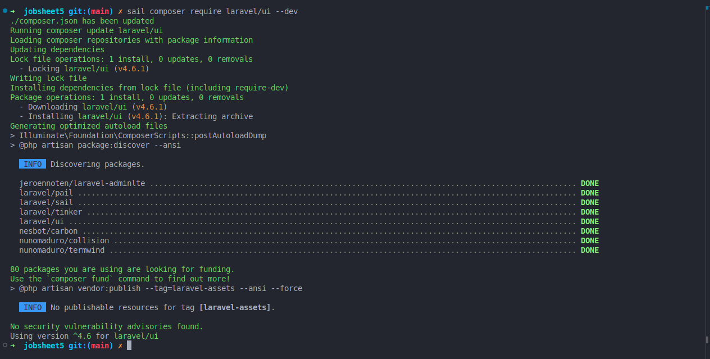
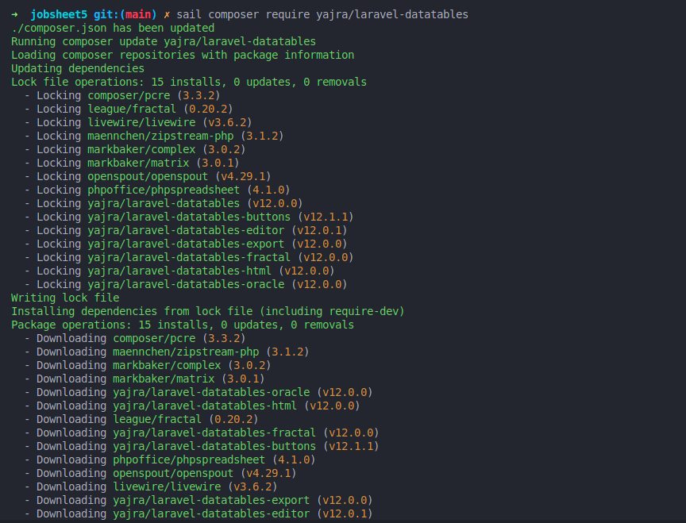
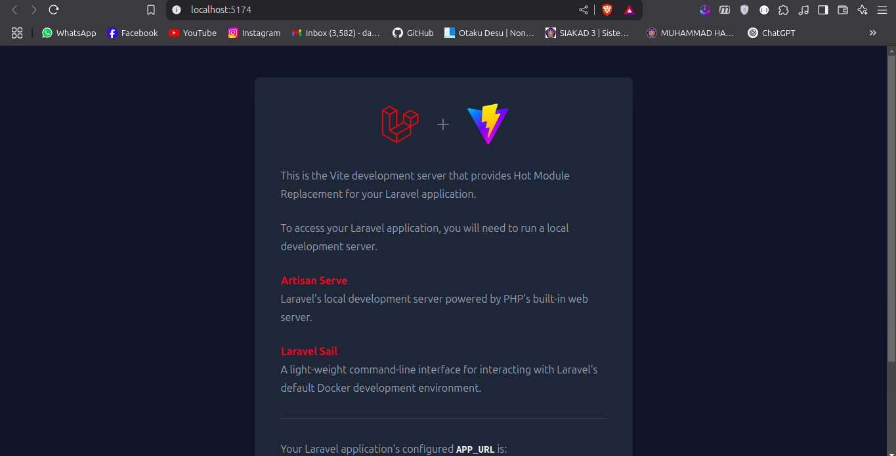
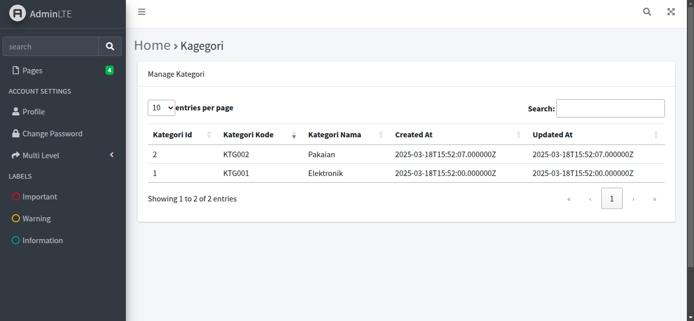
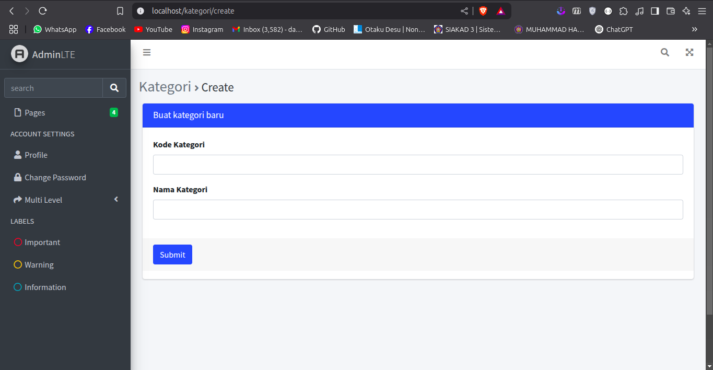

# Laporan Praktikum Jobsheet 5

## Praktikum 1

### installing adminLTE template via docker sail

```
sail composer require jeroennoten/laravel-adminlte
```

jika sudah terinstall maka akan muncul ini di composer.json

```json
"require": {
    "php": "^8.2",
    "jeroennoten/laravel-adminlte": "^3.15",
    "laravel/framework": "^12.0",
    "laravel/tinker": "^2.10.1"
},
```

### applying template

app.blade.php

```php
@extends('adminlte::page')
{{-- Extend and customize the browser title --}}
@section('title')
    {{ config('adminlte.title') }}
    @hasSection('subtitle')
        | @yield('subtitle')
    @endif
@stop
{{-- Extend and customize the page content header --}}
@section('content_header')
    @hasSection('content_header_title')
        <h1 class="text-muted">
            @yield('content_header_title')
            @hasSection('content_header_subtitle')
                <small class="text-dark">
                    <i class="fas fa-xs fa-angle-right text-muted"></i>
                    @yield('content_header_subtitle')
                </small>
            @endif
        </h1>
    @endif
@stop
{{-- Rename section content to content_body --}}
@section('content')
    @yield('content_body')
@stop
{{-- Create a common footer --}}
@section('footer')
    <div class="float-right">
        Version: {{ config('app.version', '1.0.0') }}
    </div>
    <strong>
        <a href="{{ config('app.company_url', '#') }}">
            {{ config('app.company_name', 'My company') }}
        </a>
    </strong>
@stop
{{-- Add common Javascript/Jquery code --}}
@push('js')
    <script>
        $(document).ready(function() {
            // Add your common script logic here...
        });
    </script>
@endpush
{{-- Add common CSS customizations --}}
@push('css')
    <style type="text/css">
        {{-- You can add AdminLTE customizations here --}}
        /*
                .card-header {
                border-bottom: none;
                }
                .card-title {
                font-weight: 600;
                }
                */
    </style>
@endpush

```

welcome.blade.php

```php
@extends('layouts.app')

{{-- Customize layout sections --}}
@section('subtitle', 'Welcome')
@section('content_header_title', 'Home')
@section('content_header_subtitle', 'Welcome')

{{-- Content body: main page content --}}
@section('content_body')
    <p>Welcome to this beautiful admin panel.</p>
@stop

{{-- Push extra CSS --}}
@push('css')
    {{-- Add extra stylesheets here --}}
    {{-- <link rel="stylesheet" href="/css/admin_custom.css"> --}}
@endpush

{{-- Push extra scripts --}}
@push('js')
    <script>
        console.log("Hi, I'm using the Laravel-AdminLTE package!");
    </script>
@endpush

```

view dari page welcome.blade.php


## Praktikum 2

### Integrasi dengan DataTables

Installing laravel/ui

```
sail composer require laravel/ui --dev
```



Installing DataTables

```
sail composer require yajra/laravel-datatables
```



install laravel-datatables-vite menggunakan runtime bun

```sh
➜  jobsheet5 git:(main) ✗ bun add laravel-datatables-vite
[0.67ms] ".env"
bun add v1.2.2 (c1708ea6)

+ @tailwindcss/vite@4.0.14
+ axios@1.8.3
+ concurrently@9.1.2
+ laravel-vite-plugin@1.2.0
+ tailwindcss@4.0.14
+ vite@6.2.2

installed laravel-datatables-vite@0.6.1

88 packages installed [23.85s]
```

install sass (Syntactically Awesome Style Sheets)

```sh
➜  jobsheet5 git:(main) ✗ bun add sass
[0.21ms] ".env"
bun add v1.2.2 (c1708ea6)

installed sass@1.86.0 with binaries:
 - sass

16 packages installed [5.92s]
```

content dari package.json file setelah instalasi

```json
{
    "private": true,
    "type": "module",
    "scripts": {
        "build": "vite build",
        "dev": "vite"
    },
    "devDependencies": {
        "@tailwindcss/vite": "^4.0.0",
        "axios": "^1.7.4",
        "concurrently": "^9.0.1",
        "laravel-vite-plugin": "^1.2.0",
        "tailwindcss": "^4.0.0",
        "vite": "^6.0.11"
    },
    "dependencies": {
        "laravel-datatables-vite": "^0.6.1",
        "sass": "^1.86.0"
    }
}

```
setup app.js & app.scss

app.js
```js
import "./bootstrap";
import "../sass/app.scss";
import "laravel-datatables-vite";

```

app.scss
```scss
// Fonts
@import url("https://fonts.bunny.net/css?family=Nunito");

// Bootstrap
@import "bootstrap/scss/bootstrap";

// DataTables
@import "bootstrap-icons/font/bootstrap-icons.css";
@import "datatables.net-bs5/css/dataTables.bootstrap5.min.css";
@import "datatables.net-buttons-bs5/css/buttons.bootstrap5.min.css";
@import "datatables.net-select-bs5/css/select.bootstrap5.css";

```
vite page


membuat datatables

```sh
jobsheet5 git:(main) ✗ sail artisan datatables:make Kategori

   INFO  DataTable [app/DataTables/KategoriDataTable.php] created successfully.  
```

modif KategoriDataTable
```php
<?php

namespace App\DataTables;

use App\Models\KategoriModel;
use Illuminate\Database\Eloquent\Builder as QueryBuilder;
use Yajra\DataTables\EloquentDataTable;
use Yajra\DataTables\Html\Builder as HtmlBuilder;
use Yajra\DataTables\Html\Button;
use Yajra\DataTables\Html\Column;
use Yajra\DataTables\Html\Editor\Editor;
use Yajra\DataTables\Html\Editor\Fields;
use Yajra\DataTables\Services\DataTable;

class KategoriDataTable extends DataTable
{
    /**
     * Build the DataTable class.
     *
     * @param QueryBuilder $query Results from query() method.
     */
    public function dataTable(QueryBuilder $query): EloquentDataTable
    {
        return (new EloquentDataTable($query))
            /*
->addColumn('action', 'kategori.action') */
            ->setRowId('id');
    }
    /**
     * Get the query source of dataTable.
     */
    public function query(KategoriModel $model): QueryBuilder
    {
        return $model->newQuery();
    }
    /**
     * Optional method if you want to use the html builder.
     */
    public function html(): HtmlBuilder
    {
        return $this->builder()
            ->setTableId('kategori-table')
            ->columns($this->getColumns())
            ->minifiedAjax()
            //->dom('Bfrtip')
            ->orderBy(1)
            ->selectStyleSingle()
            ->buttons([
                Button::make('excel'),
                Button::make('csv'),
                Button::make('pdf'),
                Button::make('print'),
                Button::make('reset'),
                Button::make('reload')
            ]);
    }
    /**
     * Get the dataTable columns definition.
     */
    public function getColumns(): array
    {
        return [
            /*
Column::computed('action')
->exportable(false)
->printable(false)
->width(60)
->addClass('text-center'), */
            Column::make('kategori_id'),
            Column::make('kategori_kode'),
            Column::make('kategori_nama'),
            Column::make('created_at'),
            Column::make('updated_at'),
        ];
    }
    /**
     * Get the filename for export.
     */
    protected function filename(): string
    {
        return 'Kategori_' . date('YmdHis');
    }
}
```

modif KategoriModel
```php
<?php

namespace App\Models;

use Illuminate\Database\Eloquent\Model;
use Illuminate\Database\Eloquent\Relations\HasMany;

class KategoriModel extends Model
{
    protected $table = 'm_kategori';
    protected $primaryKey = 'kategori_id';
    protected $fillable = ['kategori_kode', 'kategori_nama'];

    public function barang(): HasMany
    {
        return $this->hasMany(BarangModel::class, 'barang_id', 'barang_id');
    }
}
```

modif KategoriController
```php
<?php

namespace App\Http\Controllers;

use App\DataTables\KategoriDataTable;
use Illuminate\Http\Request;
use Illuminate\Support\Facades\DB;

class KategoriController extends Controller
{
    public function index(KategoriDataTable $dataTable)
    {

        return $dataTable->render("kategori.index");
    }
}

```

tampilan /kategori


## Praktikum 3

### membuat form

routes
```php
Route::get("/kategori/create", [KategoriController::class, "create"]); // route untuk method create menampilkan view
Route::post("/kategori", [KategoriController::class], "store"); // route untuk post request
```

KategoriController
```php
class KategoriController extends Controller
{
    public function index(KategoriDataTable $dataTable)
    {
        return $dataTable->render('kategori.index');
    }

    public function create()
    {
        return view('kategori.create');
    }

    public function store(Request $request)
    {
        KategoriModel::create([
            'kategori_kode' => $request->kodeKategori,
            'kategori_nama' => $request->namaKategori,
        ]);

        return redirect('/kategori');
    }
}
```

method ``create`` untuk menampilkan view, method ``store`` untuk create data

create.blade

```php
@extends('layouts.app')

{{-- Customize layout sections --}}

@section('subtitle', 'Kategori')
@section('content_header_title', 'Kategori')
@section('content_header_subtitle', 'Create')

{{-- Content body: main page content --}}
@section('content')
    <div class="container">
        <div class="card card-primary">
            <div class="card-header">
                <h3 class="card-title">Buat kategori baru</h3>
            </div>

            <form method="post" action="../kategori">
                <div class="card-body">
                    <div class="form-group">
                        <label for="kodekategori">Kode Kategori</label>
                        <input type="text" class="form-control" id="kodekategori" name="kodekategori" placeholder="">
                    </div>

                    <div class="form-group">
                        <label for="namakategori">Nama Kategori</label>
                        <input type="text" class="form-control" id="namakategori" name="namakategori" placeholder="">
                    </div>
                </div>

                <div class="card-footer">
                    <button type="submit" class="btn btn-primary">Submit</button>
                </div>
            </form>
        </div>
    </div>
@endsection

```

page


membuat middleware checking csrf token

```sh
sail artisan make:middleware VeriftCsrfToken
```

```php
<?php

namespace App\Http\Middleware;

use Illuminate\Foundation\Http\Middleware\VerifyCsrfToken as Middleware;

class VerifyCsrfToken extends Middleware
{
    /**
     * The URIs that should be excluded from CSRF verification.
     *
     * @var array<int, string>
     */
    protected $except = [
        '/kategori'
    ];
}
```